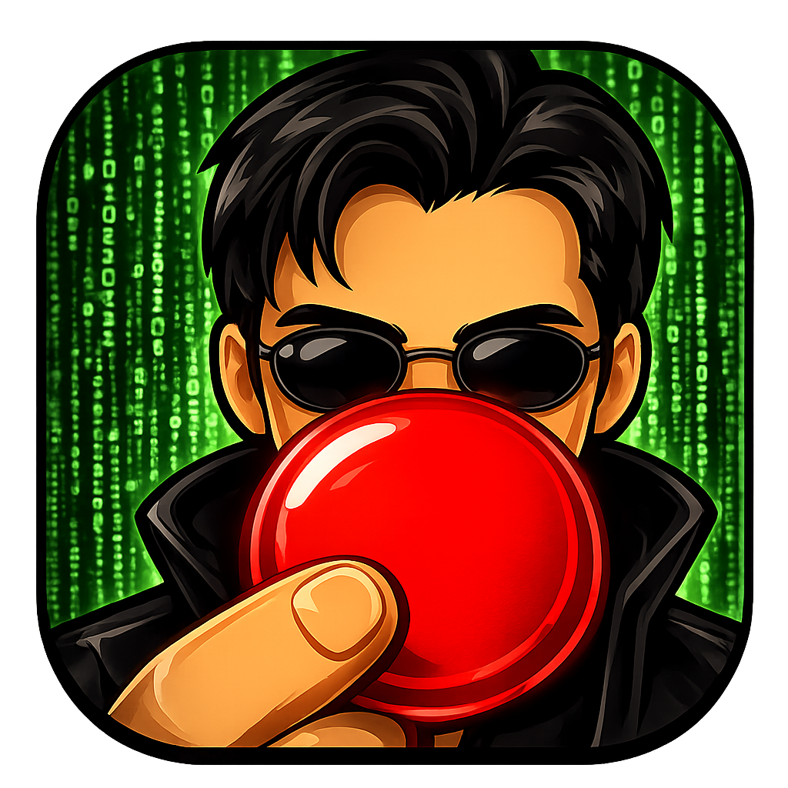

<p align="center">
  
</p>

# 🔴 React

## 🧠 What is this?

You know that feeling when you're stuck in a game, binge-watching YouTube, or just staring at the wall — and your brain is so full of junk that you can't remember a single thing you actually *enjoy* doing?

**React** is the red pill.

It doesn't ask "how are you?"  
It doesn't set reminders.  
It doesn't track your sleep.

It just gives you **4 options**. Things you've chosen before when you felt exactly like this.

👇 Tap an action. The app closes. You go do it.

---

## 📱 Download

**Option 1: Install via ADB**
```bash
adb install app-debug.apk
```

**Option 2: Manual install**

Download the APK from [Releases](https://github.com/lexbayart/React/releases)

Or clone and build yourself.

**Requirements:** Android 13+

---

## 🎮 8 states

Choose where you are right now:

🎮 Gamer — stuck in a game loop  
📺 Viewer — zombie-scrolling YouTube  
💬 Talker — trapped in an endless conversation  
😴 Sleeper — heavy after a meal  
🔄 Zombie — doing nothing, staring at a wall  
🔧 Stuck — work dead end, overworked  
😰 Anxious — can't focus, worry spiral  
😔 Sad — no energy, heavy heart  

## 🎲 How it works

1. Open React
2. Tap the emoji that matches your state
3. See 4 action cards
4. Tap 🎲 to reshuffle (no repeats)
5. Tap ➕ to add your own action
6. Tap an action → app closes → you go do it

The more often you choose an action, the more likely it appears next time.  
No questions. No "did it help?" Just frequency. The app learns quietly.

## 📊 Stats & export

Long press anywhere on the main screen → see your top actions per state.  
Export as JSON + CSV → share to Telegram, email, or analyze with AI.

## 🧠 Philosophy

This app is not a planner. Not a tracker. Not a notification machine.

It's a **lifeline** for the moment your brain freezes.  
The red pill. Choose to wake up. Choose to remember what you love.

## 🛠 Tech

- Kotlin + Jetpack Compose
- Room database (local only)
- Android 13+
- No internet. No accounts. No ads.

## 👤 Made by @lexbayart

Open source. For everyone.

---

*"When you're stuck, you don't need a survey. You need options."*
